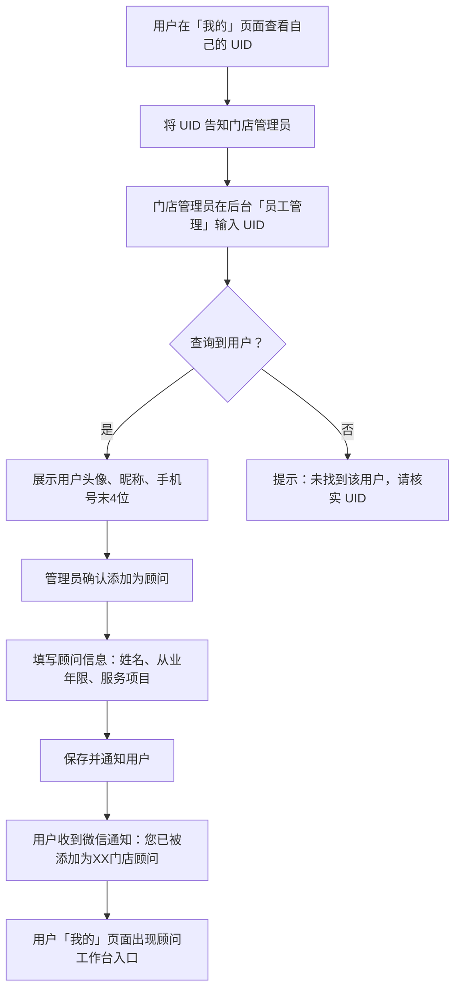
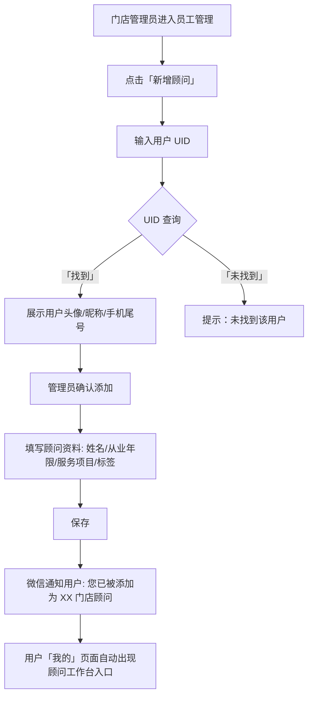
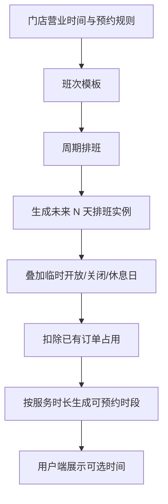
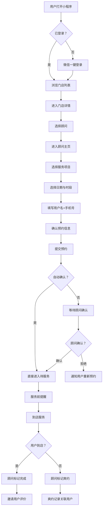
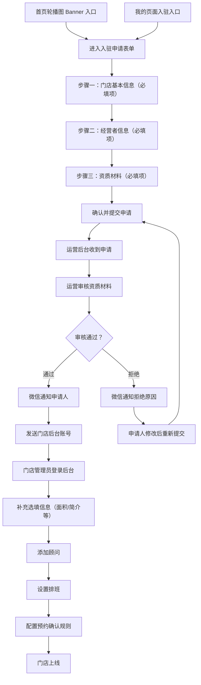
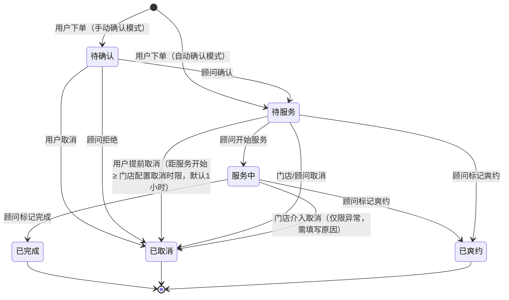
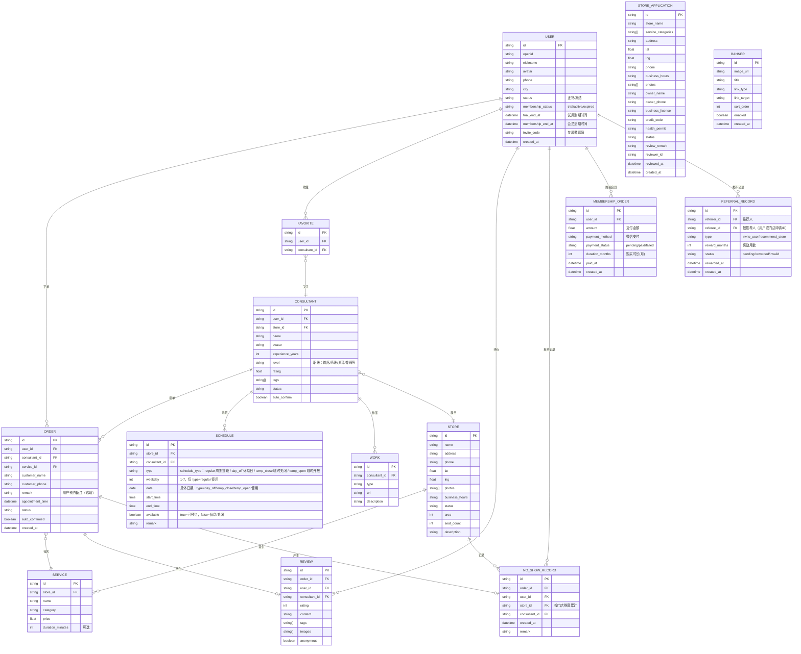

# 易可约 — 产品需求文档（PRD）

> **版本**：v2.0 MVP
> **日期**：2026-05-11
> **产品形态**：微信小程序 + 门店管理后台 + 运营管理后台

---

## 一、项目概述

### 1.1 产品定位

面向 15～45 岁学生、上班族及年轻群体的**高端顾问预约平台**，涵盖理发师、美容师、按摩师等服务顾问。通过"锁定顾问 + 智能推荐"两大核心能力，解决用户找人难、排队久的痛点，同时帮助顾问稳定客流、门店提升翻台率。

### 1.2 产品形态（4 端）

| 端 | 形态 | 使用者 | 说明 |
|---|---|---|---|
| **用户端** | 微信小程序 | C 端用户 | 找门店、找顾问、预约、评价、商家入驻 |
| **顾问工作台** | 微信小程序（个人中心入口） | 理发师/美容师等 | 接单、排班、消息 |
| **门店管理后台** | Web 管理台 | 门店管理员/店长 | 门店管理、员工管理、排班、订单、数据 |
| **运营管理后台** | Web 管理台 | 平台运营 | 门店入驻审核、轮播图管理、全局数据、系统配置 |

### 1.3 核心解决的 3 大痛点

```
用户痛点                    顾问痛点                    门店痛点
┌──────────────────┐      ┌──────────────────┐      ┌──────────────────┐
│ • 找不到好理发师   │      │ • 客流不稳定       │      │ • 翻台率低         │
│ • 排队等候时间久   │      │ • 老客户难留存     │      │ • 获客成本高       │
│ • 被过度推销       │      │ • 时间利用率低     │      │ • 爽约率居高不下   │
│ • 总忘记剪发时间   │      │                    │      │                    │
└──────────────────┘      └──────────────────┘      └──────────────────┘
```

---

## 二、目标用户画像

### 2.1 用户端

| 维度 | 描述 |
|---|---|
| 年龄 | 15 ~ 45 岁 |
| 群体 | 学生、上班族、年轻白领 |
| 核心诉求 | 快速找到合适的顾问、避免排队、拒绝推销 |
| 使用场景 | 定期理发/美容/按摩预约、发现新顾问 |

### 2.2 顾问端

| 维度 | 描述 |
|---|---|
| 角色 | 理发师、美容师、按摩师等服务顾问 |
| 核心诉求 | 稳定客流、高效排班、留住老客户 |
| 使用场景 | 管理预约订单、处理排班 |

### 2.3 门店管理者

| 维度 | 描述 |
|---|---|
| 角色 | 店长、门店管理员 |
| 核心诉求 | 提升翻台率、降低爽约率、数据经营 |
| 使用场景 | 管理门店信息、员工排班、查看经营数据 |

---

## 三、核心功能

### 3.1 两大核心亮点

#### 🔒 锁定顾问

用户可收藏固定顾问，下次预约直接选择，避免"踩雷"。建立用户与顾问之间的长期信任关系。

#### 🧠 智能推荐

按以下维度推荐顾问：

| 筛选维度 | 说明 |
|---|---|
| 📍 距离 | 基于 LBS 定位推荐附近顾问 |
| ⭐ 评分 | 综合评分排序 |
| 🎨 风格 | 擅长风格标签匹配 |
| 💰 价格 | 价格区间筛选 |
| 🚫 "不推销"标签 | 特色标签，解决用户核心痛点 |

### 3.2 预约确认机制

> [!IMPORTANT]
> 预约**默认需要顾问手动确认**，同时支持**自动确认开关**：
> - **门店管理员**在后台可**直接控制每个顾问**的自动确认开关（逐个切换）
> - 提供**「全部开启」和「全部关闭」**两个批量操作按钮，快速统一设置
> - **顾问**也可在工作台**自行修改**自己的自动确认状态
> - 若某顾问开启了自动确认，用户预约该顾问后直接进入"待服务"状态，无需顾问操作

> [!NOTE]
> **周期自动预约**（每 7/10/15/20 天自动约同一顾问，到期提醒）为核心亮点功能，**MVP 版本暂不实现**，列入 v2.0 规划。

---

## 四、端一：用户端微信小程序

### 4.1 Tab 结构

用户端小程序共 **3 个 Tab**：

| Tab | 说明 |
|---|---|
| **首页** | 轮播图 + 分类入口 + 优秀评价展示 |
| **预约** | 门店列表（分类筛选）→ 门店详情 → 顾问主页 → 预约 |
| **我的** | 个人信息、预约订单、收藏、商家入驻、顾问工作台入口等 |

### 4.2 信息架构

```
用户端小程序（3 Tab）
├── Tab 1：首页
│   ├── 轮播图 Banner（运营后台可配置）
│   ├── 分类入口（理发/美容/按摩...）→ 点击跳转预约 Tab
│   └── 优秀评价展示 → 点击进入对应门店详情
│
├── Tab 2：预约（门店列表）
│   ├── 顶部筛选栏
│   │   ├── 搜索（门店名/顾问名）
│   │   └── 分类筛选（理发/美容/按摩...）
│   ├── 门店列表
│   │   └── 门店卡片（名称、评分、距离、标签、首图）→ 点击进入门店详情
│   └── 门店详情页
│       ├── 门店展示（页面顶部：门店名称 + 地址 + 营业时间，门店照片仍做背景图；点击展开底部弹窗展示全部信息包含电话/进一步详情）
│       ├── 服务项目列表（含价格，时长可选）
│       ├── 顾问列表
│       │   ├── 顾问卡片（头像、姓名、评分、标签）
│       │   └── 快速预约入口
│       └── 顾问主页
│           ├── 基本信息（头像、姓名、从业年限、标签、"不推销"标记）
│           ├── 评分与评价
│           ├── 作品展示
│           ├── 可预约时段
│           ├── 收藏
│           └── 预约入口（选服务 → 选日期时段 → 填写预约信息 → 确认）
│               └── 注：用户名/手机号由后端存储，首次填写后自动带入
│
├── Tab 3：我的
│   ├── 个人信息（展示 UID，支持复制，用于顾问身份绑定）
│   ├── 预约订单
│   │   ├── 待服务
│   │   ├── 已完成 → 可评价
│   │   └── 已取消（需提前1小时取消，门店可配置时间）
│   ├── 我的会员
│   │   ├── 会员状态（试用中/已过期/会员有效期）
│   │   ├── 免费试用倒计时（新用户3个月）
│   │   ├── 购买会员（¥9.9/年）
│   │   └── 邀请奖励（拉新用户/推荐门店赠送会员时效）
│   ├── 我的收藏（收藏的顾问）
│   ├── 我的评价
│   ├── 消息通知
│   ├── 基础设置（头像、昵称修改表单）
│   ├── 商家入驻 → 进入入驻申请表单
│   ├── 顾问工作台入口 ⭐（仅当用户已是顾问身份时展示，切换至顾问身份）
│   └── 关于我们（版本号、用户协议、隐私政策、客服联系方式）
│
├── 商家入驻申请表单（小程序原生页面）
│   ├── 步骤一：门店基本信息（仅必填项）
│   ├── 步骤二：经营者信息（仅必填项）
│   ├── 步骤三：资质材料上传（仅必填项）
│   └── 确认提交
│
└── 评价（从已完成订单进入）
    ├── 评分（1-5星）
    ├── 文字评价
    ├── 标签评价（技术好/不推销/准时/环境好...）
    └── 图片上传
```

### 4.3 功能模块详述

#### 4.3.1 首页

| 功能 | 说明 | 优先级 |
|---|---|---|
| 轮播图 Banner | 顶部轮播 Banner，支持运营后台配置，可链接到门店/活动/入驻等页面 | P0 |
| 分类入口 | 理发、美容、按摩等服务大类快捷入口，点击跳转至预约 Tab 并自动筛选对应分类 | P0 |
| 优秀评价展示 | 展示平台精选的优质评价（含评分、内容摘要、顾问/门店信息），点击可进入对应门店详情 | P0 |

**轮播图 Banner 建议内容（运营可在后台配置更换）**：

| 序号 | Banner 主题 | 链接目标 | 说明 | 优先级 |
|---|---|---|---|---|
| 1 | 🏪 商家入驻招募 | 入驻申请表单页 | "优质门店免费入驻，立即申请"，长期展示，吸引门店入驻 | **P0** |
| 2 | ⭐ 本周人气顾问 TOP5 | 预约 Tab（热门排序） | 展示高评分/高预约量顾问，激励用户尝试预约 | **P0** |
| 3 | 📢 平台公告/节假日安排 | 公告详情页 | 节假日营业调整、平台升级通知等运营公告 | **P0** |
| 4 | 🆕 新店开业优惠 | 对应门店详情页 | 新入驻门店曝光位，可配合限时优惠活动 | P1 |
| 5 | 🎨 潮流发型/美容趋势 | 对应分类的预约 Tab | 结合季节/潮流趋势做内容引导，拉动特定品类流量 | P1 |

> [!NOTE]
> 首页**不做搜索功能**，搜索统一放在「预约」Tab 顶部（支持按门店名、顾问名搜索）。首页定位为引导发现和运营推广，通过轮播图做活动/入驻引导，通过分类入口快速跳转，通过优秀评价建立信任感。

#### 4.3.2 预约 Tab — 门店列表

| 功能 | 说明 | 优先级 |
|---|---|---|
| 搜索 | 支持按门店名、顾问名搜索 | P0 |
| 分类筛选 | 顶部按服务分类筛选门店 | P0 |
| 门店列表 | 展示门店卡片：名称、评分、距离、首图、标签，点击进入门店详情 | P0 |
| 距离排序 | 基于 LBS 定位按距离排序 | P0 |

#### 4.3.3 门店详情页

| 功能 | 说明 | 优先级 |
|---|---|---|
| 门店信息 | **页面顶部**展示门店名称、地址、营业时间，门店照片作背景图；点击处弹出底部弹窗展示全部信息（含电话、更多照片等） | P0 |
| 服务项目 | 门店提供的服务项目列表，含**价格**，时长**可选** | P0 |
| 顾问列表 | 门店下所有顾问，展示头像、姓名、评分、标签 | P0 |
| 快速预约 | 顾问列表中支持快捷预约 | P1 |

#### 4.3.4 顾问主页

| 功能 | 说明 | 优先级 |
|---|---|---|
| 基本信息 | 头像、姓名、从业年限、所属门店 | P0 |
| 标签体系 | 擅长风格 + "不推销"等特色标签 | P0 |
| 评分与评价 | 综合评分 + 历史评价列表 | P0 |
| 作品展示 | 图片/视频作品集 | P1 |
| 可预约时段 | 可视化日历展示可预约时间 | P0 |
| 服务项目与价格 | 顾问可提供的服务列表及定价 | P0 |
| 收藏/锁定 | 一键收藏为"我的顾问" | P0 |
| 预约入口 | 进入预约流程 | P0 |

#### 4.3.5 预约流程

```
选择服务项目 → 选择日期与时段 → 填写用户名+手机号 → 确认预约信息 → 提交预约
                                                                       ↓
                                               ┌─────────── 已开启自动确认？──────────┐
                                               ↓ 是                                   ↓ 否
                                     直接进入"待服务"                         等待顾问确认
                                               ↓                                      ↓
                                   预约成功通知用户                         顾问确认/拒绝
                                               ↓                                ↓ (确认)
                                     到期服务提醒 ←────────────────── 预约成功通知
                                               ↓
                                         到店服务
                                               ↓
                                     顾问标记完成/爽约
                                               ↓
                                        邀请评价
```

| 步骤 | 说明 | 优先级 |
|---|---|---|
| 选择服务项目 | 显示顾问可提供的项目、价格，时长可选 | P0 |
| 选择日期时段 | 日历视图 + 可用时段列表；可选时段由门店营业时间、顾问排班、服务时长、已占用订单、临时关闭时段共同计算 | P0 |
| 填写预约信息 | 填写用户名、手机号（后端存储，后续自动带入） | P0 |
| 备注（选填） | 用户可填写特殊需求、发型参考、忌口等信息，随订单透传给顾问 | P1 |
| 确认预约 | 展示预约详情，含服务项目、时间、门店地址、用户信息、备注 | P0 |
| 自动/手动确认 | 根据该顾问的自动确认配置决定 | P0 |
| 预约提醒 | 服务前 1 小时/30 分钟微信消息提醒 | P1 |

##### 可预约时段生成规则

用户端不直接读取排班模板，而是读取后端计算后的「可预约时段」。后端按以下顺序生成：

1. 读取门店预约规则：营业时间、预约粒度、最多提前预约天数、最少提前预约分钟数、取消时限。
2. 读取顾问有效排班：周期排班生成的日程 + 临时开放/关闭 + 休息日。
3. 过滤门店非营业时间、顾问休息时间、顾问离职/停用状态、顾问未绑定该服务项目的情况。
4. 按所选服务时长检查连续可用格子，例如服务 60 分钟且粒度 30 分钟时，需要连续 2 个空闲格子。
5. 扣除已存在订单占用：待确认、待服务、服务中均视为占用；已取消、已拒绝不占用；已爽约按原预约时间占用至服务开始后释放。
6. 扣除最少提前预约限制，例如当前 10:10、最少提前 30 分钟，则 10:30 不可约，最早从 11:00 或下一个满足粒度的时段开始。
7. 返回可选时段列表，并在提交预约时再次做同样校验，避免多人同时抢同一时段。

> [!IMPORTANT]
> 预约提交必须以后端二次校验为准。若用户停留页面期间时段被他人占用，提交时提示「该时段已被预约，请重新选择时间」并刷新可预约时段。

> [!IMPORTANT]
> **爽约预约限制（按门店维度）**：爽约次数按「用户 × 门店」独立累计，同一用户在某门店爽约达 **3 次** 后，**仅在该门店**被限制预约，不影响该用户在其他门店的预约。
> - 用户提交该门店预约时若已达阈值，页面提示「您在本门店累计爽约已达 3 次，暂无法继续预约本门店的服务，请联系门店处理」并阻止提交；
> - 进入该门店的顾问主页、确认预约页时提前展示提醒（如「您在本门店的爽约次数 2/3，请按时到店」）；
> - 解除由对应门店或运营后台操作（详见 6.2.5 异常处理）；其他门店的预约不受影响。

#### 4.3.6 预约订单（我的 → 预约订单）

| 状态 Tab | 说明 | 用户操作 |
|---|---|---|
| 待服务 | 顾问已确认（或自动确认），等待到店 | 可取消（限默认1小时，最大可设置提前 24 小时） |
| 已完成 | 服务完成 | 可评价 |
| 已取消 | 用户/顾问取消 | 可查看原因 |

#### 4.3.7 评价系统

| 功能 | 说明 | 优先级 |
|---|---|---|
| 星级评分 | 1-5 星综合评分 | P0 |
| 文字评价 | 自由文字反馈 | P0 |
| 标签评价 | 预设标签：技术好 / 不推销 / 准时 / 耐心 / 环境好 | P0 |
| 图片上传 | 上传效果图 | P1 |
| 匿名评价 | 可选择匿名 | P2 |

#### 4.3.8 关于我们

| 功能 | 说明 | 优先级 |
|---|---|---|
| 应用版本号 | 展示当前小程序版本号 | P0 |
| 用户协议 | H5 页面展示平台用户协议 | P0 |
| 隐私政策 | H5 页面展示隐私政策 | P0 |
| 客服联系方式 | 客服电话/微信，点击拨打或复制 | P0 |
| 意见反馈 | 用户可提交反馈（文字 + 图片） | P1 |

#### 4.3.10 会员制

> [!IMPORTANT]
> 会员制是平台核心商业模式之一，通过免费试用期吸引用户体验，到期后引导付费解锁核心功能，同时通过拉新奖励实现用户增长。

##### 会员档位

| 项目 | 说明 |
|---|---|
| 会员名称 | 易可约会员 |
| 会员价格 | **¥9.9 / 年** |
| 会员档位 | 当前仅一个档位 |
| 付费方式 | 微信支付（小程序内完成） |

##### 免费试用期

| 项目 | 说明 |
|---|---|
| 试用时长 | **3 个月**（自注册之日起计算） |
| 试用权益 | 与正式会员完全一致，可查看顾问可预约时段并正常预约 |
| 倒计时展示 | 用户端「我的」页面及「我的会员」页面展示试用剩余天数倒计时 |
| 到期提醒 | 试用到期前 7 天、3 天、1 天通过微信订阅消息提醒用户 |
| 到期后限制 | 顾问主页的**可预约时段被屏蔽**（显示遮罩提示「开通会员查看可约时段」），无法看到具体可预约时间，无法发起预约 |

##### 到期后功能限制

| 功能 | 试用期内 / 会员有效期内 | 试用过期 & 未购买会员 |
|---|---|---|
| 浏览门店列表 | ✅ 正常 | ✅ 正常 |
| 浏览门店详情 | ✅ 正常 | ✅ 正常 |
| 浏览顾问主页（基本信息/评价/作品） | ✅ 正常 | ✅ 正常 |
| 查看顾问可预约时段 | ✅ 正常 | ❌ **屏蔽**（显示遮罩+开通会员引导） |
| 发起预约 | ✅ 正常 | ❌ **禁止**（提示开通会员） |
| 查看历史订单 | ✅ 正常 | ✅ 正常 |
| 收藏顾问 | ✅ 正常 | ✅ 正常 |
| 评价 | ✅ 正常 | ✅ 正常 |

##### 拉新奖励机制

> [!NOTE]
> 拉新奖励以赠送会员有效期时效的方式激励老用户进行推广，降低平台获客成本。

**模式一：老用户邀请新用户注册**

| 项目 | 说明 |
|---|---|
| 邀请方式 | 老用户在「我的会员」页面生成专属邀请码/邀请链接/小程序分享卡片 |
| 判定条件 | 新用户通过邀请链接/码注册并完成首次登录 |
| 奖励对象 | **老用户**（邀请人） |
| 奖励内容 | 赠送 **3 个月** 会员有效期（累加到当前有效期上） |
| 新用户权益 | 新用户正常获得 3 个月免费试用期（与普通注册一致） |
| 奖励上限 | 不限次数，每成功邀请一位新用户即奖励一次 |
| 到账时间 | 新用户完成注册后即时到账 |

**模式二：老用户推荐门店入驻平台**

| 项目 | 说明 |
|---|---|
| 推荐方式 | 老用户在「我的会员」或「商家入驻」页面填写推荐门店信息，或将专属推荐码提供给门店经营者在入驻表单中填入 |
| 判定条件 | 被推荐门店完成入驻申请并**审核通过** |
| 奖励对象 | **推荐人**（老用户） |
| 奖励内容 | 赠送 **3 个月** 会员有效期（累加到当前有效期上） |
| 奖励上限 | 不限次数，每成功推荐一家门店即奖励一次 |
| 到账时间 | 门店审核通过后即时到账 |
| 防作弊 | 同一门店仅允许一位推荐人获得奖励；推荐人不能是门店经营者本人 |

##### 会员有效期计算规则

| 场景 | 规则 |
|---|---|
| 新用户注册 | 免费试用期 = 注册时间 + 3 个月 |
| 试用期内购买会员 | 会员到期日 = 试用到期日 + 1 年 |
| 试用过期后购买会员 | 会员到期日 = 购买时间 + 1 年 |
| 会员有效期内续费 | 会员到期日 = 当前到期日 + 1 年 |
| 会员过期后续费 | 会员到期日 = 购买时间 + 1 年 |
| 拉新奖励到账 | 会员到期日 = max(当前到期日, 当前时间) + 3 个月 |
| 推荐门店奖励到账 | 会员到期日 = max(当前到期日, 当前时间) + 3 个月 |


#### 4.3.9 商家入驻申请表单（小程序原生页面）

**入口**：首页轮播图 Banner + 「我的」页面常驻入口

**表单仅展示必填项**，采用小程序原生页面开发，可直接调用微信定位、手机号获取、图片上传等能力。选填的补充信息在入驻审核通过后，由门店在后台自行完善（运营后台也可补充配置）。

##### 步骤一：门店基本信息

| 字段 | 类型 | 说明 |
|---|---|---|
| 门店名称 | 文本输入 | 门店对外展示名称 |
| 服务分类 | 下拉选择（多选） | 理发/美容/按摩等，从平台分类库选取 |
| 门店地址 | 地址选择器 | 调用微信定位 + 手动输入详细地址 |
| 门店电话 | 电话输入 | 客户联系电话 |
| 营业时间 | 时间选择器 | 每日营业起止时间（如 09:00 - 21:00） |
| 门店环境照片 | 图片上传（≥3张） | 门头照、内部环境、服务区域等（最多 9 张） |

##### 步骤二：经营者信息

| 字段 | 类型 | 说明 |
|---|---|---|
| 经营者姓名 | 文本输入 | 门店负责人/法人姓名 |
| 经营者手机号 | 手机号输入 | 可调用微信一键获取手机号 |

> [!NOTE]
> **身份证信息（身份证号、正反面照片）因涉及用户敏感隐私，调整为 P2 版本实现**。MVP 阶段仅采集经营者姓名 和 手机号。

##### 步骤三：资质材料

| 字段 | 类型 | 说明 |
|---|---|---|
| 营业执照照片 | 图片上传 | 清晰可辨的营业执照照片 |
| 统一社会信用代码 | 文本输入 | 营业执照上的 18 位代码 |
| 卫生许可证 | 图片上传 | 卫生/健康相关许可证照片 |

> [!NOTE]
> 以上**全部为必填项**。以下选填信息在入驻通过后，由门店在**门店管理后台**自行补充完善，运营后台也可代为配置：
> - 门店面积、服务座位数、门店简介
> - 经营者微信号、从业年限
> - 消防安全证明、其他资质证明、补充说明

##### 提交与后续

| 环节 | 说明 |
|---|---|
| 提交确认 | 汇总展示全部填写信息，用户确认后提交 |
| 提交成功 | 展示"申请已提交，预计 1-3 个工作日内审核"提示 |
| 审核通知 | 审核结果通过微信订阅消息通知申请人 |
| 审核通过 | 发送门店管理后台登录账号（手机号 + 初始密码） |
| 审核拒绝 | 告知拒绝理由，允许修改后重新提交 |
| 查看进度 | 在「我的 → 商家入驻」中可查看申请状态（待审核/已通过/已拒绝） |

---

## 五、端二：顾问工作台（小程序内嵌）

### 5.1 入口与身份切换

顾问工作台嵌入用户端微信小程序的**「我的」页面**中。顾问身份由门店管理员通过 **UID 查询添加**后激活，登录后可在"用户模式"和"顾问模式"之间自由切换。

> [!NOTE]
> **UID 展示位置**：用户端「我的」页面头像下方展示用户 UID（如 `UID: EKY20260418`），方便门店管理员通过 UID 查找用户并添加为顾问。

### 5.2 顾问添加流程



### 5.3 信息架构

```
顾问工作台
├── 工作台首页
│   ├── 今日概览（今日预约数、待接单数）
│   ├── 今日排班时间线
│   ├── 自动确认开关（可修改）
│   └── 快捷操作
├── 预约管理
│   ├── 待确认订单（接单/拒单）
│   ├── 今日订单
│   ├── 历史订单
│   └── 订单详情
├── 排班设置
│   ├── 查看周期排班（由门店后台统一配置，只读）
│   ├── 休息日设置
│   └── 临时调整
├── 消息
│   ├── 新订单通知
│   ├── 取消通知
│   └── 评价通知
└── 我的资料
    ├── 个人信息编辑（含 UID 展示）
    ├── 服务项目管理（仅选择门店现有服务）
    ├── 作品管理（上传/删除）
    └── 标签管理
```

### 5.4 功能模块详述

#### 5.4.1 工作台首页

| 功能 | 说明 | 优先级 |
|---|---|---|
| 今日数据卡片 | 今日预约数、待接单数 | P0 |
| 排班时间线 | 时间轴展示今日每个时段的预约情况 | P0 |
| 自动确认开关 | 顾问可自行开启/关闭预约自动确认（门店管理员也可在后台统一修改） | P0 |
| 快捷操作 | 一键接单/拒单/查看详情 | P0 |
| 近期评价摘要 | 展示最新 3 条评价 | P2 |

#### 5.4.2 预约管理

| 功能 | 说明 | 优先级 |
|---|---|---|
| 新订单接单/拒单 | 收到预约后确认或拒绝，拒绝需填写理由 | P0 |
| 订单状态流转 | 待确认 → 已确认 → 服务中 → 已完成 | P0 |
| 标记服务开始/完成 | 手动标记服务状态 | P0 |
| 标记爽约 | 标记用户爽约，爽约记录关联到用户档案 | P0 |
| 历史订单查询 | 按日期/客户查询历史订单 | P1 |

#### 5.4.3 排班设置

> [!NOTE]
> **周期排班由门店管理员在门店后台统一设置**，顾问工作台仅提供「查看」及「临时调整」能力，避免与门店排班冲突。

| 功能 | 说明 | 优先级 |
|---|---|---|
| 查看周期排班 | 只读展示门店后台为该顾问设置的每周固定可预约时间 | P0 |
| 休息日设置 | 标记不可预约日期（临时休假） | P0 |
| 时段粒度 | 由门店后台统一配置（默认 30 分钟），影响预约刻度 | P1 |
| 临时调整 | 临时关闭/开放某个时段（不影响周期排班模板） | P1 |

##### 顾问端快捷调整

顾问工作台面向「当天和近期临时变化」，不承担整店排班配置：

| 操作 | 说明 | 规则 |
|---|---|---|
| 今日请假 | 一键关闭今天剩余未预约时段 | 已有待确认/待服务订单不自动取消，需顾问或门店逐单处理 |
| 明日请假 | 一键关闭明天全部未预约时段 | 若明天已有订单，保存前提示订单数量并要求确认 |
| 临时关闭时段 | 选择日期 + 起止时间，关闭未被订单占用的空闲时段 | 不允许覆盖已有待确认/待服务/服务中订单 |
| 临时开放时段 | 在门店营业时间内临时开放额外可预约时段 | 不能超出门店营业时间，不能和已有订单冲突 |
| 恢复默认排班 | 删除某天临时调整，回到门店后台周期排班结果 | 不影响已生成订单 |

> [!IMPORTANT]
> 顾问端调整只影响本人；门店管理员在后台可查看并覆盖顾问端临时调整。涉及已有订单的取消、改约必须走订单流程，不通过排班调整静默改变。

#### 5.4.4 消息通知

| 消息类型 | 触发时机 | 优先级 |
|---|---|---|
| 新预约通知 | 用户下单时 | P0 |
| 取消通知 | 用户取消预约时 | P0 |
| 评价通知 | 用户完成评价时 | P1 |
| 提醒通知 | 服务开始前 30 分钟 | P1 |

---

## 六、端三：门店管理后台（Web）

### 6.1 信息架构

```
门店管理后台 (Web)
├── 数据看板
│   ├── 今日/本周/本月核心指标
│   │   ├── 预约数 / 完成数 / 取消数 / 爽约数
│   │   ├── 翻台率
│   │   └── 顾问利用率
│   └── 趋势图表
├── 门店管理
│   ├── 门店信息（名称、地址、电话、营业时间、门店照片）
│   ├── 门店补充信息（面积、座位数、简介等入驻时的选填项）
│   ├── 服务项目管理（价格、时长、分类）
│   ├── 预约确认设置
│   │   ├── 顾问自动确认开关（逐个控制）
│   │   ├── 「全部开启」按钮
│   │   └── 「全部关闭」按钮
│   ├── 预约规则设置（粒度、提前天数、取消规则等）
│   └── 门店公告
├── 员工管理
│   ├── 顾问列表（在职/离职）
│   ├── 通过 UID 查询用户并添加为顾问
│   ├── 编辑顾问信息
│   ├── 移除顾问（解绑门店关系）
│   └── 顾问评分排名 [P2]
├── 排班管理
│   ├── 排班日历视图
│   ├── 批量排班
│   ├── 调班/换班
│   └── 排班模板
├── 订单管理
│   ├── 全部订单列表
│   ├── 订单详情
│   ├── 异常订单处理（爽约/投诉）
│   └── 订单导出
└── 数据分析
    ├── 顾问绩效排名
    ├── 服务项目分析
    ├── 客户画像
    ├── 时段热力图 [P2]
    └── 评价分析
```

### 6.2 功能模块详述

#### 6.2.1 数据看板

| 指标 | 说明 | 优先级 |
|---|---|---|
| 今日预约数 | 当日新增预约数量 | P0 |
| 完成服务数 | 当日完成服务数量 | P0 |
| 取消/爽约数 | 当日取消与爽约统计 | P0 |
| 翻台率 | 总服务数 / 总可用时段数 | P1 |
| 顾问利用率 | 已预约时段 / 总可用时段 | P1 |
| 趋势图表 | 折线图展示核心指标变化趋势 | P1 |

#### 6.2.2 门店管理

| 功能 | 说明 | 优先级 |
|---|---|---|
| 基本信息编辑 | 门店名称、地址、联系电话、营业时间 | P0 |
| 门店照片 | 上传门店环境照片（最多 9 张） | P0 |
| 门店补充信息 | 入驻时的选填项：门店面积、服务座位数、门店简介等，入驻后在此补充完善 | P0 |
| 服务项目管理 | CRUD 服务项目，含价格、时长、分类 | P0 |
| 预约确认设置 | 展示顾问列表，每个顾问有独立的自动确认开关；提供「全部开启」「全部关闭」两个批量操作按钮 | P0 |
| 预约规则设置 | 设置预约时段粒度（15/30/60min），定义全店预约最小时间刻度，预约提前天数（最多 7 天）、取消规则（默认1小时，最大提前 24 小时）、时间粒度等 | P1 |
| 门店公告 | 发布用户可见的公告（如节假日安排） | P2 |

#### 6.2.3 员工管理

| 功能 | 说明 | 优先级 |
|---|---|---|
| 顾问列表 | 在职/离职顾问列表，支持状态切换 | P0 |
| 新增顾问（UID 查询） | 输入用户 UID → 查询并展示用户信息 → 确认添加 → 填写顾问资料 → 微信通知用户 | P0 |
| 编辑顾问信息 | 弹窗修改顾问基础信息、关联的门店服务项目、标签 | P0 |
| 移除顾问 | 解绑顾问与门店关系，已有预约自动通知用户 | P0 |
| 顾问评分排名 | 按综合评分排名 | P2 |
| 离职处理 | 顾问离职后自动转单/通知用户 | P1 |

##### 新增顾问流程（UID 查询）



> [!NOTE]
> 添加成功后，系统通过微信订阅消息通知用户「您已被添加为 XX 门店顾问」，用户「我的」页面将自动出现顾问工作台入口。

#### 6.2.4 排班管理

| 功能 | 说明 | 优先级 |
|---|---|---|
| 日历视图 | 按日/周/月查看全部顾问排班 | P0 |
| 批量排班 | 多顾问批量设置排班 | P0 |
| 排班模板 | 保存常用排班模板，快速复用 | P1 |
| 调班换班 | 管理员手动调整排班 | P1 |
| 排班冲突检测 | 自动检测排班冲突并提醒 | P2 |

##### 排班设计目标

排班模块优先解决门店高频操作：店长能在 1-3 分钟内完成一周基础排班；顾问能快速处理请假和临时加班；用户端只展示真实可约时段，避免下单后再反复改约。

##### 核心对象

| 对象 | 说明 | 示例 |
|---|---|---|
| 门店预约规则 | 全店统一的预约粒度、提前预约、取消规则、营业时间 | 粒度 30 分钟，最多提前 7 天，营业 10:00-22:00 |
| 班次模板 | 可复用的时间段组合，可包含休息段 | 早班 10:00-18:00；晚班 14:00-22:00；全班 10:00-22:00 |
| 周期排班 | 顾问每周固定班次，作为长期默认值 | Tony 周一/三/五早班，周二/四晚班 |
| 排班实例 | 按周期排班生成到具体日期的实际班次 | 2026-04-15 Tony 10:00-18:00 |
| 临时调整 | 针对具体日期的覆盖规则 | 4月18日请假；4月20日 19:00-21:00 临时开放 |
| 预约占用 | 已有订单对时段的锁定 | 11:00-12:00 女士剪发占用 Tony 两个 30 分钟格子 |

##### 权限边界

| 角色 | 能力 |
|---|---|
| 门店管理员/店长 | 配置门店规则、班次模板、周期排班、批量排班、临时调班、处理冲突订单 |
| 顾问 | 查看本人排班、设置本人休息日、临时关闭/开放本人时段 |
| 平台运营 | 默认不参与门店日常排班，仅在门店详情中查看排班概况，必要时协助排查异常 |

##### 排班生成逻辑



生成规则：

1. 排班实例默认滚动生成未来 7 天，与「最多提前预约天数」保持一致；若门店设置为 14 天，则生成 14 天。
2. 周期排班是基础规则，临时调整优先级更高；同一天存在临时关闭时，以临时关闭为准。
3. 临时开放必须落在门店营业时间内；若门店节假日公告设置为休业，则整店不可预约。
4. 服务时长可以大于预约粒度，系统必须检查连续空闲格子，不允许只检查起始时间。
5. 待确认订单也占用时段，避免多个用户同时预约同一顾问同一时间。
6. 顾问离职、停用、未绑定服务项目时，不生成可预约时段。

##### 快捷排班能力

门店后台需要提供面向店长的快速操作，减少逐格点击：

| 快捷操作 | 使用场景 | 交互说明 |
|---|---|---|
| 一键套用上周 | 本周排班基本延续上周 | 选择日期范围后复制上周同星期排班，保存前展示变更摘要 |
| 按模板批量排班 | 多名顾问使用同一班次 | 选择顾问 + 日期范围 + 星期 + 班次模板，一次生成 |
| 固定轮班 | 早晚班轮转 | 设置 A/B 两组模板和轮转周期，如「做二休一」「早晚交替」 |
| 批量休息 | 节假日、团建、门店装修 | 选择日期范围，整店或指定顾问批量关闭 |
| 批量加班 | 节前高峰、活动日 | 选择顾问和额外时间段，批量临时开放 |
| 冲突只看 | 调整前快速排查风险 | 显示已有订单、重复班次、超出营业时间、服务时长不足等问题 |

##### 推荐默认配置

MVP 初始可内置 3 个默认模板，门店开通后即可使用：

| 模板 | 时间 | 说明 |
|---|---|---|
| 早班 | 10:00-18:00 | 适合常规日间服务 |
| 晚班 | 14:00-22:00 | 适合下班后客流 |
| 全班 | 10:00-22:00 | 适合高峰日或小团队门店 |

默认预约粒度为 30 分钟。理发、美容、按摩等服务时长以服务项目配置为准，服务时长不是 30 分钟整数倍时向上取整到最近粒度，例如 45 分钟按 60 分钟占用。

##### 冲突校验

保存排班或临时调整时必须校验：

| 冲突类型 | 处理方式 |
|---|---|
| 超出门店营业时间 | 阻止保存，提示可用营业区间 |
| 同一顾问时段重叠 | 阻止保存，提示重叠日期和时间 |
| 覆盖已有待确认/待服务/服务中订单 | 阻止直接关闭，提示先处理订单；支持跳转订单列表 |
| 服务时长无法放入剩余时段 | 用户端不展示该起始时段；后台预览中标记为不可约 |
| 顾问未绑定服务项目 | 用户选择该服务时不展示该顾问时段 |
| 顾问离职/停用 | 不生成新可约时段；已有订单进入异常处理 |

##### 修改排班对订单的影响

| 场景 | 规则 |
|---|---|
| 调整未来空闲时段 | 立即生效，用户端刷新后不再展示或新增展示 |
| 调整已有订单时段 | 不允许直接覆盖，必须先取消、改约或由门店联系用户处理 |
| 顾问请假且已有订单 | 系统列出受影响订单，门店可逐单取消或改约其他顾问 |
| 删除班次模板 | 不影响已生成的排班实例；仅停止后续继续使用该模板 |
| 修改班次模板 | 默认只影响后续新生成排班；已生成实例需店长选择是否同步覆盖 |

##### 排班页面建议

| 页面 | 关键能力 |
|---|---|
| 周视图 | 默认视图，行是顾问，列是日期，单元格展示班次名称、订单数、冲突标记 |
| 日视图 | 按时间轴展示当天所有顾问，适合查看空闲和高峰时段 |
| 月视图 | 查看休息日、节假日和整月覆盖率，不做复杂编辑 |
| 批量排班弹窗 | 顾问多选、日期范围、星期多选、模板选择、覆盖策略、保存前预览 |
| 冲突面板 | 保存前展示冲突数量，支持按顾问/日期定位 |

#### 6.2.5 订单管理

| 功能 | 说明 | 优先级 |
|---|---|---|
| 订单列表 | 全部订单列表，支持多维筛选 | P0 |
| 订单详情 | 查看订单完整信息 | P0 |
| 异常处理 | 处理爽约、投诉等异常订单 | P0 |
| 爽约管理 | 查看用户爽约记录，支持标记和解除 | P0 |
| 订单导出 | 导出订单数据为 Excel | P2 |

#### 6.2.6 数据分析

| 功能 | 说明 | 优先级 |
|---|---|---|
| 顾问绩效 | 按预约数、完成率、评分等排名 | P1 |
| 服务项目分析 | 各项目预约数量、收入占比 | P1 |
| 时段热力图 | 可视化展示一周各时段预约热度 | P2 |
| 评价分析 | 差评预警、评价趋势 | P2 |

---

## 七、端四：运营管理后台（Web）

> [!NOTE]
> MVP 版本运营后台聚焦 P0 必要功能，确保平台可运转。高级分析等功能列入后续版本。

### 7.1 信息架构

```
运营管理后台 (Web) — MVP
├── 数据大盘
│   ├── 全平台核心指标
│   │   ├── 总用户数
│   │   ├── 总门店数 / 活跃门店数
│   │   ├── 总顾问数 / 活跃顾问数
│   │   ├── 总预约数 / 完成率 / 取消率 / 爽约率
│   │   └── GMV
│   └── 基础趋势图
├── 门店管理
│   ├── 门店列表（全部/待审核/已上线/已下线）
│   ├── 门店详情（查看 + 编辑，含补充信息配置）
│   └── 上下线管理
├── 门店入驻管理
│   ├── 入驻申请列表（来源：小程序入驻表单）
│   ├── 申请详情（门店信息 + 经营者信息 + 资质材料）
│   ├── 资质审核（通过/拒绝 + 备注）
│   └── 审核记录
├── 轮播图管理
│   ├── Banner 列表（排序、上下线）
│   └── 新增/编辑 Banner（图片、标题、链接目标）
├── 用户管理
│   ├── 用户列表（全部/正常/已冻结）
│   ├── 用户详情（基本信息 + 预约记录 + 评价记录 + 爽约记录 + 会员信息）
│   └── 冻结/解冻用户
├── 会员管理
│   ├── 会员数据概览（会员总数、试用用户数、付费转化率、拉新统计）
│   ├── 会员列表（全部/试用中/正式会员/已过期）
│   ├── 会员详情（会员状态、有效期、购买记录、拉新记录）
│   └── 会员配置（试用期时长、会员价格、拉新奖励规则）
└── 系统配置
    ├── 服务分类管理
    └── 标签库管理
```

### 7.2 功能模块详述（MVP P0）

#### 7.2.1 数据大盘

| 指标 | 说明 | 优先级 |
|---|---|---|
| 用户指标 | 注册总数 | P0 |
| 门店指标 | 门店总数、活跃门店数 | P0 |
| 顾问指标 | 顾问总数、活跃顾问数 | P0 |
| 订单指标 | 总预约数、完成率、取消率、爽约率 | P0 |
| 收入指标 | GMV | P0 |
| 趋势图表 | 日/周/月核心数据趋势 | P0 |

#### 7.2.2 门店管理

| 功能 | 说明 | 优先级 |
|---|---|---|
| 门店列表 | 全平台门店列表，支持状态筛选 | P0 |
| 门店详情 | 查看和编辑门店基本信息、顾问列表、经营数据；可代门店补充选填信息 | P0 |
| 上下线管理 | 上线/下线/冻结门店 | P0 |

#### 7.2.3 门店入驻管理

| 功能 | 说明 | 优先级 |
|---|---|---|
| 入驻申请列表 | 来源为小程序入驻申请表单，按状态筛选（待审核/已通过/已拒绝） | P0 |
| 申请详情 | 展示完整申请信息：门店基本信息、经营者信息、资质材料，支持图片预览 | P0 |
| 资质审核 | 审核营业执照、卫生许可等资质，通过/拒绝 + 备注理由 | P0 |
| 审核记录 | 记录审核操作日志（审核人、时间、操作、备注） | P0 |

#### 7.2.4 轮播图管理

| 功能 | 说明 | 优先级 |
|---|---|---|
| Banner 列表 | 管理小程序首页轮播图，支持排序和上下线 | P0 |
| 新增/编辑 Banner | 上传图片、输入标题、配置跳转链接（门店/活动/入驻表单/外链） | P0 |

#### 7.2.5 用户管理

| 功能 | 说明 | 优先级 |
|---|---|---|
| 用户列表 | 全平台用户列表，支持按昵称/手机号搜索，按状态（正常/冻结）与爽约次数筛选 | P0 |
| 用户详情 | 查看用户基本信息（头像、昵称、手机号、注册时间、UID）、累计订单、按门店的爽约次数明细 | P0 |
| 预约记录 | 该用户的全部预约订单，支持按门店/状态筛选 | P0 |
| 评价记录 | 该用户发出的全部评价 | P0 |
| 爽约记录 | 按门店维度展示爽约明细（门店、顾问、订单、发生时间、备注），支持**解除某门店的爽约限制** | P0 |
| 冻结/解冻 | 对违规用户执行全局冻结，冻结后该用户无法登录或预约（与按门店的爽约限制相互独立） | P0 |

#### 7.2.6 系统配置

| 功能 | 说明 | 优先级 |
|---|---|---|
| 服务分类 | 管理全局服务分类（仅一级分类：如理发/美容/按摩…） | P0 |
| 标签库 | 管理全局标签（不推销/技术好…） | P0 |

### 7.3 后续版本扩展（非 MVP）

以下功能列入 v2.0 及后续版本：

| 功能 | 说明 | 计划版本 |
|---|---|---|
| 门店评分排名 | 按综合评分/订单量等排名 | v2.0 |
| 门店标签管理 | 管理门店分类标签 | v2.0 |
| 经营数据对比 | 多门店核心指标横向对比 | v2.0 |
| 区域热力图 | 按地理区域展示门店分布 | v2.0 |
| 异常预警 | 差评率突增、爽约率过高等自动预警 | v2.0 |
| 用户反馈/投诉处理 | 用户反馈收集、投诉工单流转（用户列表/详情已纳入 MVP） | v2.0 |
| 消息模板管理 | 管理微信订阅消息模板 | v2.0 |
| 平台规则配置 | 取消规则、爽约处罚规则等 | v2.0 |
| 入驻协议管理 | 管理入驻合同/协议模板 | v2.0 |
| Banner 数据分析 | 轮播图曝光量、点击率统计 | v2.0 |

---

## 八、核心业务流程

### 8.1 用户预约流程



### 8.2 门店入驻流程



### 8.3 订单状态机



---

## 九、数据模型概述

### 9.1 核心实体关系



---

## 十、非功能性需求

### 10.1 性能

| 指标 | 目标 |
|---|---|
| 小程序首屏加载 | ≤ 1.5 秒 |
| 接口响应时间 | P99 ≤ 500ms |
| 并发用户数 | 支持 1000+ 同时在线 |
| 图片加载 | CDN 加速 + 懒加载 |

### 10.2 安全

| 项目 | 措施 |
|---|---|
| 登录认证 | 微信 OAuth 2.0 + JWT Token |
| 数据传输 | HTTPS 全站加密 |
| 敏感数据 | 手机号、身份证等敏感信息加密存储 |
| 权限控制 | RBAC 角色权限体系 |
| 接口安全 | 接口限流 + 参数校验 |
| 资质图片 | 入驻资质图片加水印、限制下载 |

### 10.3 兼容性

| 平台 | 要求 |
|---|---|
| 微信小程序 | 基础库 ≥ 2.25.0 |
| 管理后台浏览器 | Chrome/Edge/Safari 最新 2 个版本 |
| 屏幕适配 | 小程序适配 iPhone/Android 主流机型 |

---

## 十一、版本规划

### v1.0 — MVP（当前版本）

> 核心目标：跑通"用户找门店 → 找顾问 → 预约 → 服务 → 评价"闭环 + 门店入驻自助申请

| 端 | 核心功能 |
|---|---|
| 用户端 | 微信登录、轮播图首页（3个P0 Banner）、浏览门店列表、找顾问、预约（填用户名+手机号）、订单管理、评价、锁定顾问、商家入驻申请（仅必填项）、**会员制（3个月免费试用+¥9.9/年+拉新奖励）** |
| 顾问端 | 接单/拒单、标记完成/爽约、排班设置、自动确认开关、消息通知 |
| 门店后台 | 门店信息管理（含补充选填项）、员工管理、排班管理、预约确认设置（逐个控制+批量开关）、订单查看、基础数据 |
| 运营后台 | 门店入驻审核（对接小程序表单）、门店管理（含编辑+代配选填信息）、轮播图管理、基础数据大盘、服务分类/标签管理、**会员管理（会员数据、拉新统计）** |

### v2.0 — 增长版本

| 功能 | 说明 |
|---|---|
| 🔄 周期自动预约 | 每 7/10/15/20 天自动约同一顾问，到期提醒 |
| 🚫 顾问时段禁用 | 顾问可手动设置某天/某个时段禁止预约（如私事、培训等） |
| 💳 在线支付 | 接入微信支付，支持预约付款/到店付款 |
| 🎁 会员体系升级 | 多档位会员、积分、优惠券（基础会员制已在 v1.0 实现） |
| 📊 高级数据分析 | 客户画像、流失预警、经营建议 |
| 💬 IM 即时通讯 | 用户与顾问在线聊天 |
| 🏢 运营后台扩展 | 用户管理、门店排名、区域热力图、异常预警、平台规则配置 |
| 📊 Banner 数据 | 轮播图曝光量、点击率统计 |
| 🖼️ 扩展轮播图 | 新增"新店开业优惠"、"潮流趋势"等 P1 Banner |

### v3.0 — 生态版本

| 功能 | 说明 |
|---|---|
| 🏪 多门店管理 | 连锁品牌多门店统一管理 |
| 📱 App 客户端 | 独立 App（iOS + Android） |
| 🤖 AI 推荐 | 基于用户行为的个性化推荐 |
| 📈 开放平台 | API 开放给第三方系统对接 |

---

## 十二、技术架构建议

```
┌─────────────────────────────────────────────────────────┐
│                      用户端 & 顾问端                      │
│                    微信小程序 (Taro/Uni-App)               │
└─────────────────┬───────────────────────────────────────┘
                  │
┌─────────────────┴───────────────────────────────────────┐
│                    门店后台 & 运营后台                      │
│                     Web (React/Vue)                       │
└─────────────────┬───────────────────────────────────────┘
                  │ HTTPS / RESTful API
┌─────────────────┴───────────────────────────────────────┐
│                      API Gateway                         │
│                    (Nginx / Kong)                         │
└─────────────────┬───────────────────────────────────────┘
                  │
┌─────────────────┴───────────────────────────────────────┐
│                    Backend Service                        │
│              Node.js (Hono / Fastify / Elysia)            │
├─────────────────────────────────────────────────────────┤
│  Auth    │  User   │  Order  │  Store  │  Schedule       │
│  Service │  Service│  Service│  Service│  Service         │
└─────────────────┬───────────────────────────────────────┘
                  │
┌─────────────────┴───────────────────────────────────────┐
│                    Data Layer                             │
│  PostgreSQL │ Redis │ OSS/COS (图片)  │ 微信 API         │
└─────────────────────────────────────────────────────────┘
```

---

> [!IMPORTANT]
> 本文档为 MVP 版本 PRD，标注 P0 的功能为 MVP 必须交付项，P1 为重要但可延后，P2 为体验增强项。文档将随产品迭代持续更新。
